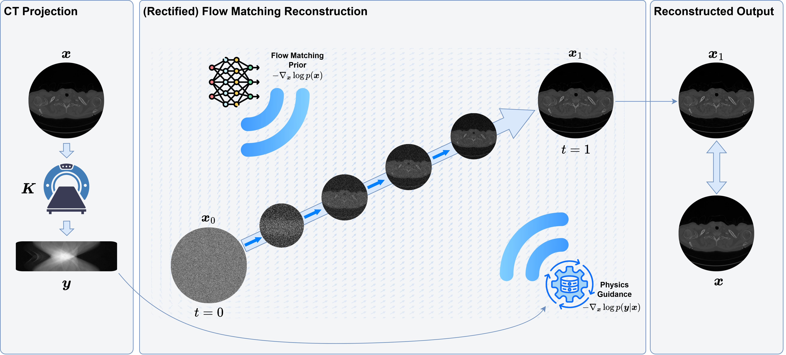
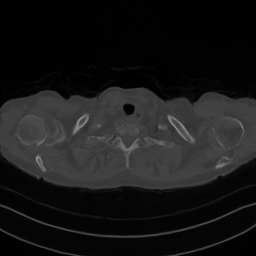

# Physics-Guided Flow Matching for CT Image Reconstruction

This repository contains code and experiment outputs for the paper **"Physics-Guided Flow Matching for CT Image Reconstruction"** (in submission to *IEEE Transactions on Medical Imaging*).



## Overview
Physics-guided flow matching integrates CT forward models with generative flow matching to improve reconstruction quality under limited-angle and noisy acquisition settings. The repository includes:

- Training and evaluation scripts (`src/train.py`, `src/test.py`).
- Model and operator implementations in `src/models/`.
- Configuration files for training and finetuning in `configs/`.
- Example outputs and visualizations in `outputs/`.

## Repository layout

```
configs/        # YAML configs for training/finetuning
experiments/    # Experiment notes and utilities
outputs/        # Example reconstructions and metrics
src/            # Training, evaluation, and model code
assets/         # Figures used in the README
```

## Getting started

### Environment
This codebase targets Python and PyTorch-based workflows. Install the packages below (versions are not pinned; adjust to your system/GPU):

- `torch`
- `numpy`
- `opencv-python`
- `albumentations`
- `pyyaml`
- `tqdm`
- `matplotlib`
- `pandas`
- `torchmetrics`
- `astra-toolbox`
- `monai`
- `monai-generative`

> Tip: If you only need the flow-matching pipeline (not the diffusion comparison), you can omit `monai`/`monai-generative`.

### Training
Run a training job with one of the provided configs:

```bash
python src/train.py --config configs/train_config.yaml
```

### Reconstruction / Evaluation
Reconstruct a single image with a trained checkpoint:

```bash
python src/test.py \
  --config configs/finetune_config.yaml \
  --weights /path/to/checkpoint.pth \
  --img_path /path/to/gt.png \
  --method flowdps \
  --steps 500
```

## Example input → output reconstruction
Below is an example of a limited-angle sinogram input and its reconstructed CT image (alongside the ground-truth image). These are sourced from the sample outputs in `outputs/`.

| Sinogram (input) | Reconstruction (output) | Ground truth |
| --- | --- | --- |
|  |  |  |

## Outputs and experiments
Reconstruction runs and metrics are written to `outputs/<experiment_name>/`, with subfolders containing:

- `recon.png` for reconstructions.
- `sinogram.png` for inputs.
- `gt.png` for references.
- `metrics.csv` for evaluation metrics.

## Data and pretrained weights
Placeholders are provided below for the dataset and model weights. Replace the links when you are ready to release them.

- **Training/Test data:** [https://drive.google.com/drive/folders/13BEiz6t57qSbwBpCtfqllmYTLmkhQeFE?usp=drive_link](TBD)
- **Pretrained model weights:** [TBD](TBD)

## Citation
If you use this repository, please cite the paper (BibTeX to be added upon publication):

```bibtex
@article{evangelista2025physics,
  title   = {Physics-Guided Flow Matching for CT Image Reconstruction},
  author  = {Anonymous},
  journal = {IEEE Transactions on Medical Imaging},
  year    = {2024},
  note    = {In submission}
}
```